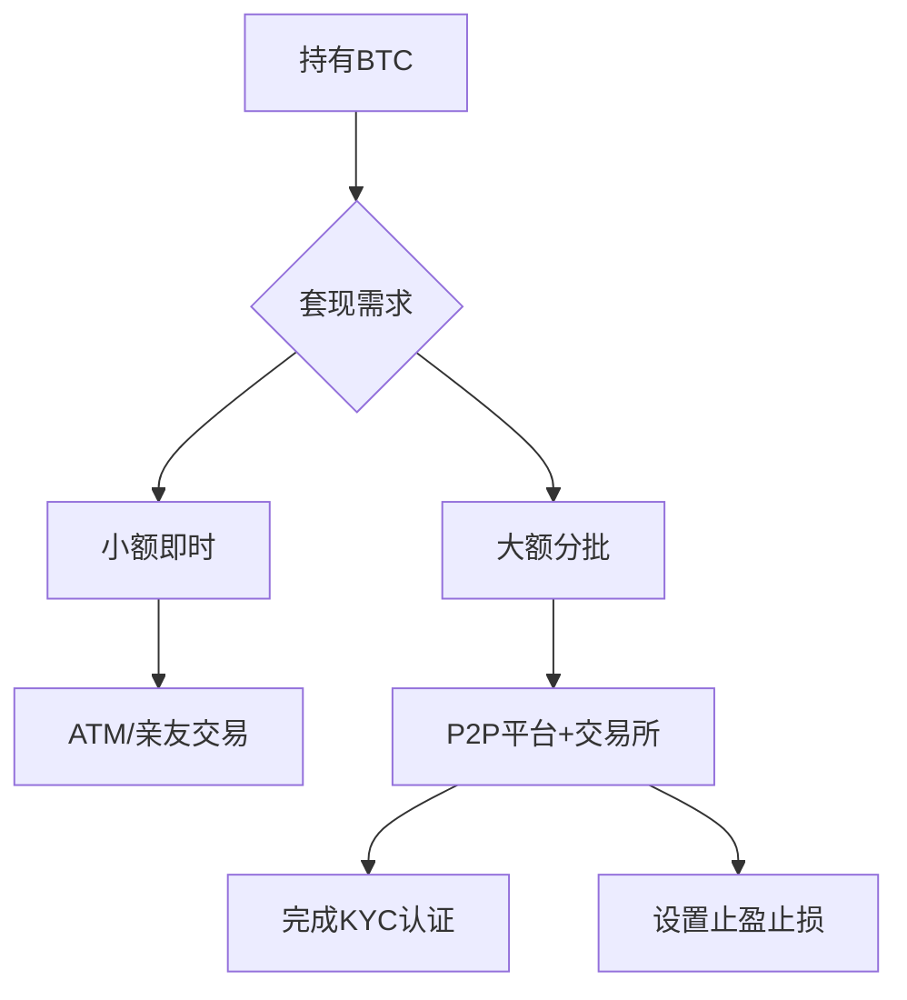

# Bitcoin利是套現攻略

在数字资产日益普及的今天，收到比特币红包既是一份惊喜，也带来了如何处理这笔数字资产的现实课题。无论是计划将BTC转化为港币现金，还是寻求其他流通方式，本文将系统梳理当下最实用的套现方案，并提供专业操作建议。

## 套现方式深度解析

### 亲友间点对点交易
作为最原始的交易方式，与亲朋好友直接交易具有以下优势：
- 零中介费用
- 灵活议价空间
- 即时到账特性

但需注意资金安全，建议采用Escrow托管服务或选择可信熟人交易。适合小额且急于套现的场景，单笔金额建议控制在5000港币以下。

### 网络P2P交易平台
LocalBitcoins等平台为全球用户提供：
- 多元支付渠道（银行转账/支付宝/现金等）
- 信用评级系统保障
- 多语言客服支持

操作要点：
1. 优先选择交易量超100笔的商家
2. 设置价格预警功能
3. 开启双重验证保障

👉 [如何选择安全的P2P交易平台？](https://bit.ly/okx_welcome)

### 加密ATM机兑换
香港现有20+加密货币ATM网点，主要分布于：
| 区域 | 网点数量 | 平均手续费 |
|------|---------|------------|
| 中环 | 5       | 5-8%       |
| 旺角 | 4       | 6-10%      |
| 尖沙咀| 3       | 4-7%       |

优势在于即时取现，但手续费普遍高于交易所10-15%。建议单日兑换额度控制在5万港币以内。

### 合规交易所抛售
对于持有量较大的投资者，推荐选择：
1. ANXpro（日交易量超2亿港币）
2. CEX.IO（支持港币出入金）
3. OKX（全球TOP3交易所）

开户需准备：
- 身份证扫描件
- 地址证明文件
- 银行卡信息

👉 [注册交易所必看指南](https://bit.ly/okx_welcome)

### 场外消费流通
接受BTC支付的商户持续增长，涵盖：
- 珠宝奢侈品（周大福/六福）
- 房地产中介（中原/美联）
- 高端餐饮（半岛酒店/翠园）

建议消费前使用BitPay等支付工具查询商户兼容性。

## 常见问题解答

Q：哪种方式手续费最低？
A：合规交易所交易成本最低，但需提前完成KYC认证

Q：P2P交易资金安全如何保障？
A：建议选择支持Escrow托管的平台，并避免大额单笔交易

Q：ATM兑换需要准备什么证件？
A：大部分机器支持匿名交易，但单日限额较低

Q：套现金额需申报税务吗？
A：根据香港税务局指引，个人小额交易无需申报，企业持有需计入投资收益

Q：如何避免汇率波动风险？
A：可分批操作或使用交易所的限价委托功能

## 风险管理建议

1. **分散套现策略**：将大额持仓拆分为3-5笔交易，通过不同渠道完成
2. **汇率监控工具**：CoinMarketCap提供多平台比价功能
3. **税务规划要点**：企业用户建议咨询专业会计师
4. **安全存储建议**：未套现部分建议转入冷钱包存储

👉 [如何选择数字资产存储方案？](https://bit.ly/okx_welcome)

## 操作流程示意图

## 市场动态追踪

2025年第一季度最新变化：
- 香港金管局计划增设50台加密ATM
- OKX上线港币直接兑换通道
- P2P平台交易限额提升至50万港币/日

建议关注官方渠道获取最新政策信息，合理规划套现策略。数字资产的流通使用正逐步规范化，选择合规渠道能最大程度保障资金安全。