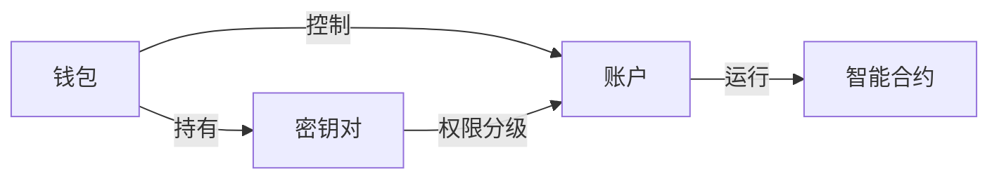

# EOS私链搭建全流程：节点启动与账户管理指南

## 一、EOSIO系统架构解析

EOSIO区块链系统由多个核心组件构成，理解这些模块的协作关系是环境搭建的基础：

| 模块名称 | 功能定位 | 典型使用场景 |
|---------|---------|-------------|
| nodeos | 核心节点服务 | 区块生产、智能合约执行 |
| cleos | 命令行交互工具 | 账户管理、合约部署 |
| keosd | 钱包管理服务 | 密钥存储与交易签名 |

> 关键提示：V1.0.5版本需先启动keosd再运行nodeos，否则会导致钱包功能异常

## 二、区块链要素关联模型

通过房产类比理解EOS系统要素：



**要素对应关系：**
- 钱包：密钥存储容器（如银行保险箱）
- 公钥/私钥：账户访问凭证（如银行卡与密码）
- 账户：区块链身份标识（如银行账户）
- 权限体系：Owner（所有权）与Active（操作权）双层控制

## 三、私链环境搭建实操

### 3.1 节点初始化流程

**启动命令示例：**
```bash
# 启动钱包服务
keosd --http-server-address=127.0.0.1:8900

# 启动节点服务
nodeos -e -p eosio \
--plugin eosio::wallet_plugin \
--plugin eosio::chain_api_plugin \
--plugin eosio::history_api_plugin \
--replay-blockchain
```

**常见错误处理：**
| 错误代码 | 解决方案 |
|---------|---------|
| 3120001 | 检查钱包插件参数配置 |
| 3050000 | 验证账户命名规则（≤12字符，仅含[a-z1-5.]） |

👉 [掌握区块链核心操作技巧](https://bit.ly/okx_welcome)

### 3.2 钱包管理进阶

**创建与恢复流程：**
```bash
# 创建新钱包
cleos wallet create -n mywallet

# 导入私钥
cleos wallet import 5KQwrPbwdL6PhXujxW37FSSQZ1JiwsST4cqQzDeyXtP79zkvFD3 -n mywallet

# 解锁钱包
cleos wallet unlock -n mywallet
```

**FAQ：钱包异常处理**
Q：重启后钱包列表为空怎么办？  
A：确保启动时包含`--plugin eosio::wallet_plugin`参数

Q：如何备份钱包？  
A：备份`~/eosio-wallet/`目录下的`.wallet`文件

## 四、账户体系构建

### 4.1 权限管理模型

**双层权限结构：**
```json
{
  "owner": {
    "threshold": 1,
    "keys": ["EOS6MRyAjQq8ud7hVNYcfnVPJqcVpscN5So8BhtHuGYqET5GDW5CV"]
  },
  "active": {
    "threshold": 1,
    "keys": ["EOS6EHAzvrpQ4wo1BPcAk86X6aGDARZgqTcAq1mJRF1SxEYgNGWN1"]
  }
}
```

👉 [深入理解区块链账户模型](https://bit.ly/okx_welcome)

### 4.2 账户创建实践

**标准创建流程：**
```bash
# 创建密钥对
cleos create key

# 部署系统合约
cleos set contract eosio build/contracts/eosio.bios -p eosio

# 创建新账户
cleos create account eosio newaccount EOS6MRyAjQq8ud7hVNYcfnVPJqcVpscN5So8BhtHuGYqET5GDW5CV EOS6EHAzvrpQ4wo1BPcAk86X6aGDARZgqTcAq1mJRF1SxEYgNGWN1
```

**错误排查表：**
| 错误码 | 原因分析 | 解决方案 |
|-------|---------|---------|
| 3080001 | 资源不足 | 使用`cleos system delegatebw`抵押资源 |
| 3050003 | 权限不足 | 检查密钥匹配与钱包解锁状态 |

## 五、系统优化与维护

### 5.1 性能调优参数
```bash
# 高性能启动示例
nodeos --chain-state-db-size-mb 4096 \
--reversible-blocks-db-size-mb 1024 \
--access-control-allow-origin "*" \
--max-body-size 10485760
```

### 5.2 日常维护指令
```bash
# 查看区块生产状态
cleos get info

# 查询账户资源占用
cleos get account eosio

# 清理缓存数据
rm -rf ~/.local/share/eosio/nodeos/data
```

👉 [获取最新区块链开发工具包](https://bit.ly/okx_welcome)

## FAQ精选

Q：如何验证节点同步状态？  
A：执行`cleos get info`查看head_block_num数值变化

Q：钱包文件损坏如何恢复？  
A：使用`cleos wallet open`命令重建钱包文件

Q：部署合约时提示"Missing authority"怎么办？  
A：确认使用`-p eosio`参数指定合约部署权限

Q：如何提高节点TPS性能？  
A：调整`--signature-provider`参数启用硬件加速

Q：交易签名超时如何处理？  
A：增加`--keosd-provider-timeout`参数值

## 六、进阶学习路径

1. 智能合约开发实践
2. 多节点集群部署
3. 跨链交互机制
4. 资源抵押与计费模型
5. 安全审计与漏洞防护

> 建议延伸阅读：EOSIO官方开发文档V2.1版特性解析
