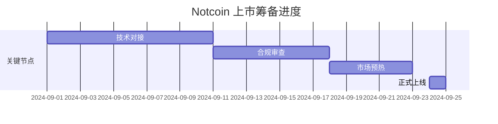

# Notcoin ($NOT) 即将登陆 LCX 交易所

## 关键信息速览
Notcoin ($NOT) 将于**9月24日 UTC时间上午10点**正式上线 LCX 交易所。这款依托 Telegram 平台运行的社交点击游戏，凭借创新的玩法和庞大的用户基础，已成为区块链游戏领域的现象级产品。

👉 [了解顶级加密交易平台](https://bit.ly/okx_welcome)

## 项目背景

### 什么是 Notcoin？
Notcoin 是由 Open Builders 团队开发的去中心化社交游戏，其核心玩法围绕虚拟金币点击机制展开：
- **用户规模**：全球注册玩家突破 3500 万
- **核心玩法**：通过点击屏幕上的金色硬币积累 $NOT 代币
- **策略要素**：能量系统限制点击频率，促使玩家优化操作节奏

作为 TON 生态的重要组成部分，该项目成功将传统点击游戏与区块链技术结合，创造出可持续的经济模型。游戏内置的多级邀请系统和动态难度调整机制，有效维持了社区活跃度。

### 创新性与市场定位
相较于传统区块链游戏，Notcoin 的竞争优势体现在：
| 特性          | 传统链游          | Notcoin                |
|---------------|-------------------|------------------------|
| 入口平台      | 独立App           | Telegram 内嵌          |
| 用户获取成本  | 高                | 依托现有社交网络       |
| 交易效率      | 链上确认延迟      | TON 高速网络支持       |
| 能源系统设计  | 固定冷却时间      | 动态能量恢复机制       |

这种轻量化的设计理念，使其在保持游戏趣味性的同时，降低了区块链技术的使用门槛。

## 交易所上市详情

### LCX 交易所优势
作为马耳他合规化运营的数字资产交易平台，LCX 的上市将为 $NOT 带来：
- **机构级流动性**：接入 150+ 国家的交易网络
- **合规背书**：符合欧盟 MiCA 监管框架要求
- **技术支撑**：分布式撮合引擎保障高并发交易

👉 [探索更多优质数字资产](https://bit.ly/okx_welcome)

### 上市时间轴

## 常见问题解答

### Q1：如何参与 Notcoin 交易？
用户需完成以下步骤：
1. 在 LCX 平台完成 KYC 认证
2. 充值 USDT 或 BTC 作为交易对
3. 通过交易界面搜索 $NOT 代码
4. 设置限价单或市价单进行交易

### Q2：游戏收益如何兑换？
玩家可通过 Telegram 钱包直接将 $NOT 提现至 LCX 账户，具体流程：
- 进入游戏钱包管理界面
- 选择「链上转账」选项
- 输入 LCX 平台充值地址
- 支付网络手续费完成转账

### Q3：上市后价格波动风险？
作为新兴资产类别，$NOT 的价格可能受到以下因素影响：
- 游戏每日活跃用户数变化
- TON 网络手续费调整
- 整体加密市场行情波动
建议投资者设置 10%-15% 的止盈止损区间。

👉 [获取专业交易策略](https://bit.ly/okx_welcome)

## 行业影响分析

### 社交金融新范式
Notcoin 的成功验证了「边玩边赚」(Play-to-Earn) 模式的商业潜力：
- 单日用户留存率达 42%，显著高于行业平均水平
- 社区自治提案通过率超过 78%
- 邀请奖励机制带动 300% 的指数级增长

### 监管动态关注点
随着欧盟 MiCA 法规实施，合规化成为交易所核心竞争力：
- LCX 的 VASP 许可证确保交易合法性
- 实时交易监控系统防范洗钱风险
- 链上透明度审计每季度公开披露

## 投资者行动指南

### 入场策略建议
针对不同风险偏好的投资者，可参考以下配置方案：
| 投资类型 | 仓位比例 | 操作建议                 |
|----------|----------|--------------------------|
| 保守型   | 5-10%    | 长期持有，分批建仓       |
| 平衡型   | 15-25%   | 波段操作，设置止损       |
| 激进型   | 30-40%   | 结合期权对冲，杠杆操作   |

### 持续跟踪指标
建议关注以下关键数据变化：
1. 每日新增玩家数量
2. 链上交易笔数周增长率
3. DApp 活跃地址变化
4. TON 网络拥堵指数

加密货币市场具有高波动性，投资者应根据自身风险承受能力做出决策。通过 LCX 平台的专业服务和 Notcoin 的创新生态，用户将获得更优质的数字资产配置体验。